<div align="center">
  


<br/>
<br/>

<a href="https://github.com/Asjad-stack">
  
</a>


</div>

---

<div align="center">

### `React Native` · `Web3 Mobile` · `Wallet Systems` · `Firebase` · `Clean Product Engineering`

</div>

<br/>

## ⚡ About Me

<table>
  <tr>
    <td width="58%" valign="top">

I’m **Muhammad Asjad**, a **React Native Developer** focused on building mobile applications that are clean, scalable, and practical for real users.

My work is centered around **cross-platform mobile apps**, **wallet-style products**, **Web3 integrations**, **Firebase-powered flows**, and **API-connected mobile experiences**.

I care about building apps that do not just work, but feel smooth, reliable, and production-ready.

<br/>


</td>
<td width="42%" valign="top">

```txt
MUHAMMAD ASJAD

Role        React Native Developer
Focus       Web3 + Mobile Wallets
Stack       React Native, Firebase, JS, TS
Interest    Secure mobile products
Mindset     Clean UX + scalable code
```

</td>
  </tr>
</table>

---

## 🧠 Developer Identity

<div align="center">


</div>

<table>
  <tr>
    <td width="25%" align="center" valign="top">
      <h3>📱 Mobile Apps</h3>
      <p>Cross-platform Android and iOS apps using React Native with clean screens, navigation, state, and reusable components.</p>
    </td>
    <td width="25%" align="center" valign="top">
      <h3>🔐 Web3 Flows</h3>
      <p>Wallet-style products, blockchain utilities, crypto libraries, transaction flows, and secure mobile experiences.</p>
    </td>
    <td width="25%" align="center" valign="top">
      <h3>🔥 Firebase</h3>
      <p>Authentication, push notifications, real-time app flows, cloud messaging, and mobile infrastructure setup.</p>
    </td>
    <td width="25%" align="center" valign="top">
      <h3>⚙️ Product Quality</h3>
      <p>Performance, clean architecture, responsive UI, maintainable code, and real-device behavior improvements.</p>
    </td>
  </tr>
</table>

---

## 🛠️ Tech Stack

<div align="center">


<br/>
<br/>


<br/>


</div>

---

## 🔍 Core Skills

<table>
  <tr>
    <td width="50%" valign="top">

### 📲 React Native Development

- Android and iOS app development  
- React Native CLI project setup  
- Component-based UI development  
- React Navigation app flows  
- Redux and persisted state management  
- Responsive layouts and reusable design systems  

</td>
<td width="50%" valign="top">

### 🔐 Web3 & Wallet Features

- Wallet-focused mobile flows  
- Blockchain integration patterns  
- WalletConnect implementation  
- Ethers.js and Web3.js usage  
- Solana web3 tooling  
- QR, clipboard, secure storage, and transaction UX  

</td>
  </tr>
  <tr>
    <td width="50%" valign="top">

### 🔥 Firebase & Real-Time Features

- Firebase app integration  
- Firebase authentication  
- Firebase cloud messaging  
- Push notification setup  
- API integration using Axios  
- App state and data synchronization  

</td>
<td width="50%" valign="top">

### ⚙️ Backend & App Infrastructure

- Node.js and Express basics  
- Environment configuration  
- Mobile-to-backend API connection  
- Local storage with SQLite  
- Deployment testing  
- Production-focused app structure  

</td>
  </tr>
</table>

---

## 🚀 Featured Public Projects

<div align="center">


</div>

<br/>

<table>
  <tr>
    <td width="50%" valign="top">

### 🔐 FlashWalletReBrand

A React Native mobile wallet-style project focused on blockchain-ready app flows, wallet utilities, Firebase messaging, authentication, local persistence, Web3 packages, Solana tooling, WalletConnect, and crypto-related mobile features.

<br/>

<a href="https://github.com/Asjad-stack/FlashWalletReBrand">
  
</a>

<br/>
<br/>


</td>
<td width="50%" valign="top">

### 🧩 Xendora

A React Native application with wallet-oriented helpers, local database structure, navigation, crypto utilities, reusable mobile components, and product-focused app foundations.

<br/>

<a href="https://github.com/Asjad-stack/Xendora">
  
</a>

<br/>
<br/>


</td>
  </tr>
  <tr>
    <td width="50%" valign="top">

### 🌐 depolybackend

A lightweight Node.js and Express backend project for basic server setup, route handling, environment configuration, and deployment testing.

<br/>

<a href="https://github.com/Asjad-stack/depolybackend">
  
</a>

<br/>
<br/>


</td>
<td width="50%" valign="top">

### 🧠 Asjad-stack

A profile repository built to present my developer identity, public work, technologies, and mobile engineering direction.

<br/>

<a href="https://github.com/Asjad-stack/Asjad-stack">
  
</a>

<br/>
<br/>


</td>
  </tr>
</table>

---

## 📌 Repository Cards

<div align="center">

<a href="https://github.com/Asjad-stack/FlashWalletReBrand">
  
</a>

<a href="https://github.com/Asjad-stack/Xendora">
  
</a>

</div>

---

## 📊 GitHub Overview

<div align="center">


<br/>
<br/>


<br/>
<br/>


</div>

---

## 🧬 Build Pattern

<div align="center">


</div>

```txt
01. Understand the product flow
02. Build clean and reusable screens
03. Connect APIs, Firebase, storage, and app state
04. Integrate Web3 and wallet logic where needed
05. Improve performance, navigation, and real-device behavior
06. Polish the UX until it feels production-ready
```

---

## 🧱 Current Focus

<table>
  <tr>
    <td width="33%" align="center" valign="top">
      <h3>🔐 Wallet Systems</h3>
      <p>Improving crypto wallet flows, Web3 integrations, transaction utilities, and secure mobile experiences.</p>
      
    </td>
    <td width="33%" align="center" valign="top">
      <h3>📱 Mobile Quality</h3>
      <p>Building React Native apps with better structure, smoother screens, reliable state, and responsive interfaces.</p>
      
    </td>
    <td width="33%" align="center" valign="top">
      <h3>🔥 App Infrastructure</h3>
      <p>Working with Firebase, APIs, local storage, notifications, and practical backend connectivity for real apps.</p>
      
    </td>
  </tr>
</table>

---

## 🏅 Highlights

<div align="center">


</div>

---

## 🤝 Connect With Me

<div align="center">

<a href="https://github.com/Asjad-stack">
  
</a>

<br/>
<br/>


</div>

---

<div align="center">


</div>
